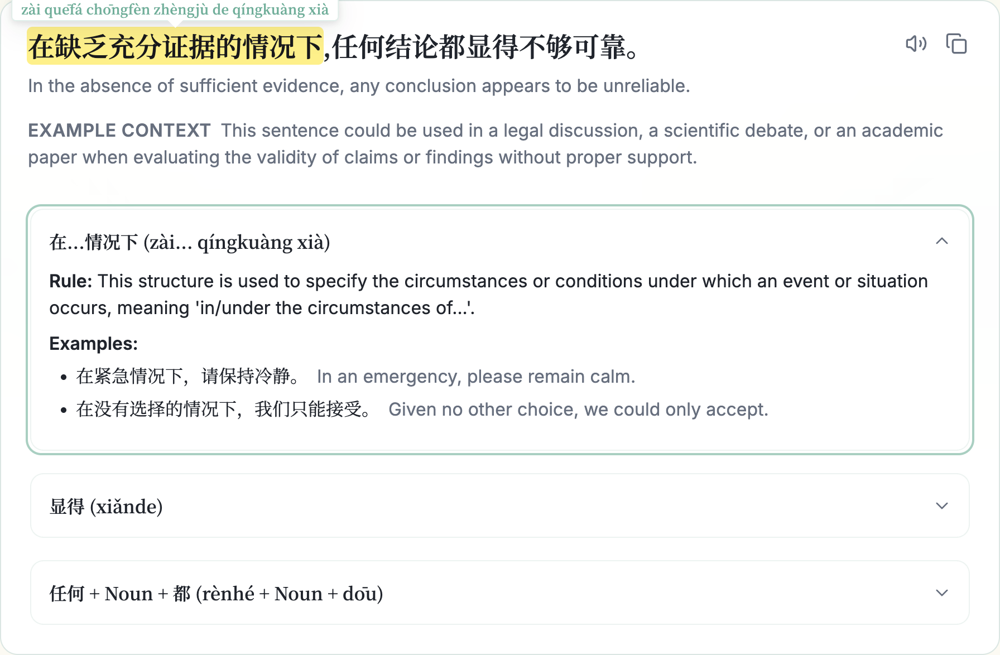
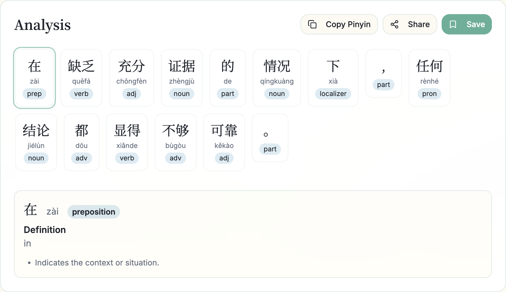

# Mandarin Lab

Mandarin Lab is a Chinese learning web app that creates smart, structured sentence breakdowns to help learners understand Chinese grammar, vocabulary, and real-world usage. The project is under active development, with more advanced learning tools planned.

## Features

### Current
- Sentence analysis
- Token-by-token sentence breakdown (role, pinyin, meaning, notes)
- Saved sentences for review

### Planned
- Dictionary
- AI tutor
- Spaced repetition flashcards (SRS)

## Demo

### Sentence Analysis


Break down sentences into structured, learner-focused components.

### Token Breakdown


Inspect individual tokens to study grammar roles, pinyin, and usage.

## Roadmap

Planned features and improvements:
- Song lyrics database with grammar and vocabulary breakdowns
- Interactive grammar exercises
- Structured daily lessons
- Real-time voice conversation practice
- Typing practice (pinyin and characters)

## Tech Stack

- Frontend: React + TypeScript + Vite
- Backend: Node.js + Express
- Database & Auth: Supabase (PostgreSQL + Google OAuth)
- AI: Google Gemini

## Project layout

```
shared/    types and zod schemas used by both sides
backend/   Express API (Gemini + Supabase)
frontend/  React app
```

`shared/schemas/sentence.schema.ts` is the single source of truth for the
sentence-analysis contract. The backend feeds it to Gemini as a response
schema and validates replies against it; the frontend's types in
`shared/types/` are derived from it with `z.infer`, so the two cannot drift.

Both workspaces use `@/` for their own source and `@shared` for the shared
package.

## Development and Running Locally

### Prerequisites

- Node.js (LTS recommended)
- npm
- A Supabase account (for database and authentication)
- A Google Cloud project (for Google OAuth)
- A Gemini API key (for sentence analysis)

### 1. Clone the repository
```bash
git clone https://github.com/vnt1c/mandarin-lab.git
cd mandarin-lab
```

### 2. Install dependencies

This is an npm workspace, so install once from the repository root — it covers
`shared`, `backend`, and `frontend` together.

```bash
npm install
```

### 3. Environment variables

Backend (`/backend/.env`)
```env
NODE_ENV=development
PORT=4000

GEMINI_API_KEY=

SUPABASE_URL=
SUPABASE_ANON_KEY=

FRONTEND_ORIGIN=http://localhost:5173
```

Frontend (`/frontend/.env`)
```env
VITE_API_BASE_URL=http://localhost:4000

VITE_SUPABASE_URL=
VITE_SUPABASE_ANON_KEY=
```

### 4. Supabase setup

* Create a Supabase project
* Enable Google OAuth in Supabase Auth
* Set the Site URL to `http://localhost:5173`
* Add a redirect URL that matches your frontend auth callback route

### 5. Run the application

From the repository root, in two terminals:

```bash
npm run dev:backend
npm run dev:frontend
```

Open `http://localhost:5173` in your browser.

Other root scripts: `npm run typecheck` and `npm run build` run across both
workspaces.

## Notes

* Sentence analysis will not work without a valid `GEMINI_API_KEY`.
* Saved sentences and authentication depend on correct Supabase configuration and policies.
* This project is intended for learning and portfolio use and is not yet production-hardened.
